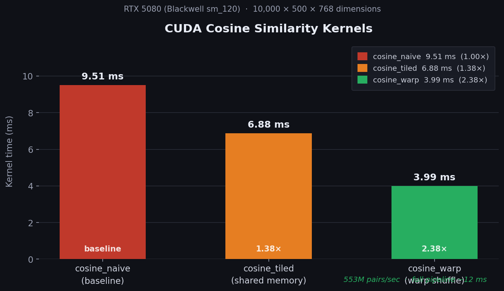

# vegmap

**GPU-accelerated document similarity and knowledge graph engine**

> Compute 553 million pairwise similarity scores per second.  
> Find relationships, gaps, and critical nodes across large document corpora in milliseconds.

regmap takes two document corpora as semantic embeddings and runs CUDA-accelerated graph algorithms over them — surfacing which source documents are covered, which are missing, which matter most, and how they relate hierarchically. The full pipeline runs in **~12 ms** on an RTX 5080.

---

## Architecture

```
  Input                      GPU Core                    Output
  ─────                      ────────                    ──────

  corpus A                 ┌──────────────┐
  (M × 768 .npy) ──────────┤              ├──────┐       coverage matrix
                           │ cosine_warp  │      │       gap report
  corpus B                 │  (sm_120)   │      │       PageRank rankings
  (N × 768 .npy) ──────────┤              │      │       knowledge graph (.dot)
                           └──────────────┘      │       Dijkstra paths
                                                 ▼
  ──────────────────       ─────────────   threshold_filter
                                           (CSR sparse graph)
  raw documents (.pdf)                           │
      parser.py      ──►   embedder.py           ▼
      chunker.py           (HuggingFace)   ┌─────────────────────┐
                                           │   Graph Algorithms   │
                                           │  BFS · PageRank      │
                          pybind11 bridge  │  Dijkstra · MST      │
                          (Python ↔ CUDA) │  Topo Sort · Floyd   │
                                           └─────────────────────┘
```

**Data flow:**
1. Parse raw documents into sections (`parser.py` + `chunker.py`)
2. Embed each section to a 768-dim float32 vector (`embedder.py`, HuggingFace)
3. Compute M × N pairwise cosine similarity on GPU (`cosine_warp`, sm_120)
4. Threshold-filter the similarity matrix to a sparse CSR graph (`threshold_filter.cu`)
5. Run graph algorithms to extract structural insights
6. Render similarity matrix, gap report, PageRank rankings, and Graphviz knowledge graph

---

## Performance

Benchmarked on **RTX 5080 (Blackwell sm_120)**, 10,000 × 500 × 768 dimensions:

| Kernel | Time | vs Baseline | Technique |
|--------|------|:-----------:|-----------|
| `cosine_naive` | 9.51 ms | 1× | one thread per pair |
| `cosine_tiled` | 6.88 ms | **1.38×** | shared-memory tiling |
| `cosine_warp`  | 3.99 ms | **2.38×** | warp-shuffle reduction |
| Full pipeline  | ~12 ms  | — | **553M pairs/sec** |



Graph kernel latencies on a 1,000-node graph:

| Kernel | Time | Notes |
|--------|------|-------|
| `threshold_filter` | 1.39 ms | 5M pairs → 1.2M edges |
| `bfs`              | 0.70 ms | single source |
| `topological_sort` | 1.58 ms | 4 hierarchy levels |
| `pagerank`         | 1.21 ms | 6 iterations to converge |
| `kruskal_mst`      | 1.10 ms | 5 Borůvka rounds, 999 MST edges |
| `dijkstra`         | 0.53 ms | single source, 2 iterations |
| `floyd_warshall`   | 1.81 ms | all-pairs shortest paths |

---

## Graph Algorithms

| Question answered | Algorithm | Kernel |
|---|---|---|
| What documents are related to what? | Floyd-Warshall (all-pairs) | `kernels/graph/floyd_warshall.cu` |
| What documents have no match in corpus B? | BFS (gap detection) | `kernels/graph/bfs.cu` |
| What is the dependency order? | Topological Sort | `kernels/graph/topological_sort.cu` |
| What are the most critical documents? | PageRank | `kernels/graph/pagerank.cu` |
| Minimum set covering all relationships? | Kruskal MST | `kernels/graph/kruskal_mst.cu` |
| Strongest similarity path between two docs? | Dijkstra | `kernels/graph/dijkstra.cu` |

---

## Installation

**Requirements:** CUDA 12.x · Python 3.12 · pybind11 · cmake 3.18+

```bash
git clone https://github.com/yourusername/regmap
cd regmap
pip install -r requirements.txt

mkdir build && cd build
cmake ..
make regmap_cuda      # builds the pybind11 extension (.so)
```

The build produces `build/regmap_cuda.cpython-312-x86_64-linux-gnu.so`, which the CLI imports automatically.

### Embedding your documents

```bash
# Parse PDFs/docx into sections
python3 -m pipeline.parser --input ./corpus_A/ --output ./parsed/A/

# Embed sections to .npy float32 vectors
python3 -m pipeline.embedder --input ./parsed/A/ --output ./embeddings/A/
```

---

## Usage

### Full analysis

```bash
python3 -m cli.main analyze \
  --regs  ./embeddings/corpus_A/ \
  --procs ./embeddings/corpus_B/ \
  --threshold 0.75 \
  --graph graph.dot
```

Output includes:
- **Similarity matrix** — COVERED / PARTIAL / GAP per source section
- **Gap report** — source sections with no match in corpus B
- **PageRank rankings** — most critical and most-connected sections
- `graph.dot` — Graphviz knowledge graph (render with `dot -Tsvg`)

### Named reports

```bash
python3 -m cli.main report --type gaps     --output gaps.txt
python3 -m cli.main report --type coverage
python3 -m cli.main report --type rankings
python3 -m cli.main report --type hierarchy
```

### Benchmark CUDA kernels

```bash
python3 -m cli.main benchmark --kernel full     # all kernels
python3 -m cli.main benchmark --kernel cosine   # similarity only
python3 -m cli.main benchmark --kernel graph    # graph only
```

---

## Sample Output

```
regmap analyze
  Source corpus : 86 sections  (corpus_A, corpus_B)
  Target corpus : 7 sections   (doc_C)
  Similarity    : 86 × 7 × 768 dims  range=[0.7984, 0.9819]

SIMILARITY MATRIX  (threshold: 0.80)
Source corpus: 86 sections   Target corpus: 7 sections
================================================================================
SOURCE SECTION                     BEST TARGET MATCH                  SIM  STATUS
--------------------------------------------------------------------------------
corpus_A | PURPOSE                 doc_C | APPLICABILITY           0.9430  COVERED
corpus_A | APPLICABILITY           doc_C | APPLICABILITY           0.9760  COVERED
corpus_B | REQUIREMENTS            doc_C | REQUIREMENTS            0.9606  COVERED
corpus_B | RESPONSIBILITIES        doc_C | RESPONSIBILITIES        0.9770  COVERED
...
SUMMARY   COVERED: 86  PARTIAL: 0  GAP: 0  Coverage: 100.0%

CRITICAL DOCUMENTS  (PageRank, top 5)
  ★  1  0.00161  corpus_A  PURPOSE
  ·  2  0.00161  corpus_A  APPLICABILITY
     3  0.00161  corpus_B  REQUIREMENTS
     ...

MOST-CONNECTED TARGETS  (top 3)
     1  0.01857  doc_C  APPLICABILITY
     2  0.01857  doc_C  REQUIREMENTS
     3  0.01806  doc_C  RESPONSIBILITIES
```

Full output: [`examples/sample_output.txt`](examples/sample_output.txt)

Render the knowledge graph:

```bash
dot -Tsvg examples/sample_knowledge_graph.dot -o graph.svg
```

---

## Tech Stack

| Layer | Technology | Purpose |
|-------|-----------|---------|
| GPU kernels | CUDA C++ (sm_120) | Cosine similarity + 6 graph algorithms |
| ML pipeline | Python 3.12 | Document parsing and section extraction |
| Embeddings | HuggingFace `all-MiniLM-L6-v2` | Text → float32 vectors (768-dim) |
| Bridge | pybind11 | CUDA ↔ Python interop |
| Output | Graphviz / terminal | Knowledge graph and formatted reports |
| CLI | Python argparse | analyze / report / benchmark commands |

---

## Project Structure

```
regmap/
├── kernels/
│   ├── similarity/
│   │   ├── cosine_naive.cu       baseline — one thread per pair
│   │   ├── cosine_tiled.cu       shared-memory tiles
│   │   └── cosine_warp.cu        warp-shuffle reduction (production)
│   └── graph/
│       ├── threshold_filter.cu   similarity matrix → sparse CSR graph
│       ├── floyd_warshall.cu     all-pairs shortest paths
│       ├── bfs.cu                gap detection from source node
│       ├── topological_sort.cu   dependency hierarchy + cycle detection
│       ├── pagerank.cu           critical document ranking
│       ├── kruskal_mst.cu        minimum spanning tree / coverage set
│       └── dijkstra.cu           strongest similarity path
├── pipeline/
│   ├── parser.py                 PDF/docx ingestion
│   ├── chunker.py                section-level text splitting
│   └── embedder.py               HuggingFace batch embedding
├── bindings/
│   ├── similarity_bindings.cu    cosine kernel → Python
│   └── graph_bindings.cu         graph kernels → Python
├── graph/
│   └── builder.py                EmbeddingSet loader (stacks .npy + _meta.json)
├── output/
│   ├── matrix.py                 similarity matrix renderer
│   ├── gap_report.py             BFS gap analysis
│   ├── rankings.py               PageRank formatter
│   └── knowledge_graph.py        Graphviz DOT export
├── cli/
│   ├── main.py                   entry point
│   └── commands/
│       ├── analyze.py            full pipeline
│       ├── report.py             named reports
│       └── benchmark.py          kernel benchmarks
├── benchmarks/
│   └── benchmark_chart.py        generates benchmark_chart.png
└── examples/
    ├── sample_output.txt
    └── sample_knowledge_graph.dot
```

---

## License

MIT
